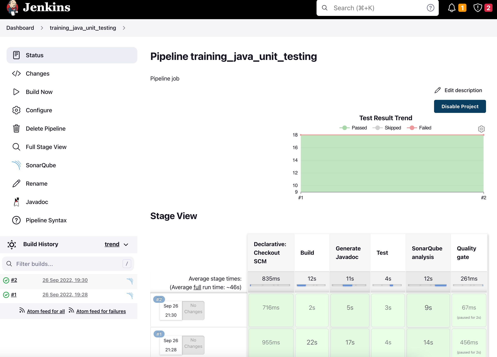

# Example Jenkins Pipeline

1. Navigate to [http://localhost:9000/admin/webhooks](http://localhost:9000/admin/webhooks)
2. Login with username `admin` and password `admin`
3. Add a webhook with the name `jenkins` and url `http://jenkins:8080/sonarqube-webhook/`
